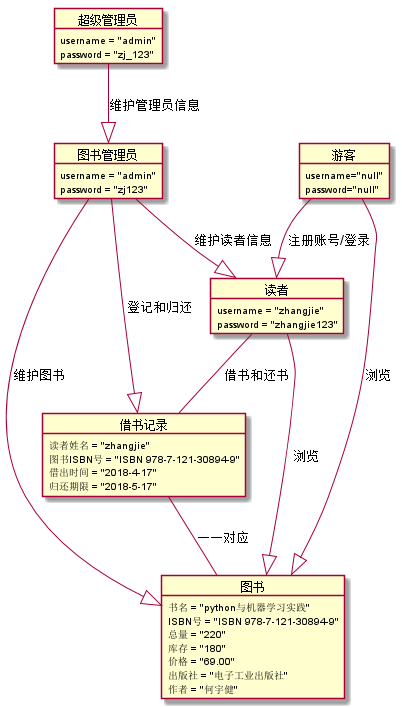

张杰的实验报告
============
## 实验三（test3）：图书管理系统对象建模

|学号|班级|姓名|
|:---------------:|:------------:|:------------:|
|201510414128|软工15-1|张杰|

### 1.图书管理系统整体的类图

**1.1图书馆管理系统用例PlantUML源码如下：**
~~~
@startuml

	class 图书管理员 {
	    管理员登录
		维护图书()
		归还图书()
		借出图书()
		维护读者信息()
	}
	class 超级管理员 {
	 	维护图书管理员信息()
	}
	class 读者 {
		查询借阅信息()
		预订图书()
		取消预订()
	}
	class 游客 {
		查询图书()
	}

	class 图书 {
	 	书名
	 	ISBN号
	 	总量
	 	库存
	 	价格
	 	出版社
	 	简介
	 	作者
	}

	class 借书记录 {
	 	读者姓名
	 	图书ISBN号
	 	借出时间
	 	归还期限
	}

	超级管理员 --|> 图书管理员 : 维护管理员信息
	图书管理员 --|> 读者 : 维护读者信息
	图书管理员 --|> 借书记录 : 登记和归还
	图书管理员 --|> 图书 : 维护图书
	读者 -- 借书记录 : 借书和还书
    	读者 --|> 图书 : 浏览
	借书记录 -- 图书 : 一一对应
	游客 --|> 图书 : 浏览
	游客 --|> 读者 : 注册账号/登录

@enduml
~~~

**1.2类图如下：**

### 2.图书管理系统对象图

**2.1图书管理系统对象关系图**

**2.1.1PlantUML源码如下：**
~~~
@startuml

	object 图书管理员 {
		 username = "admin"
		 password = "zj123"
	}
	object 超级管理员 {
		 username = "admin"
		 password = "zj_123"
	}

	object 读者 {
	 	username = "zhangjie"
		password = "zhangjie123"
	}
	object 游客 {
	    username="null"
	    password="null"
	}

	object 图书 {
	 	书名 = "python与机器学习实践"
	 	ISBN号 = "ISBN 978-7-121-30894-9"
	 	总量 = "220"
	 	库存 = "180"
	 	价格 = "69.00"
	 	出版社 = "电子工业出版社"
	 	作者 = "何宇健"
	}

	object 借书记录 {
	 	读者姓名 = "zhangjie"
	 	图书ISBN号 = "ISBN 978-7-121-30894-9"
	 	借出时间 = "2018-4-17"
	 	归还期限 = "2018-5-17"
	}

    超级管理员 --|> 图书管理员 : 维护管理员信息
	图书管理员 --|> 读者 : 维护读者信息
	图书管理员 --|> 借书记录 : 登记和归还
	图书管理员 --|> 图书 : 维护图书
	借书记录 -- 图书 : 一一对应
	读者 -- 借书记录 : 借书和还书
    读者 --|> 图书 : 浏览
	游客 --|> 图书 : 浏览
	游客 --|> 读者 : 注册账号/登录

@enduml
~~~

**2.1.2对象图如下：**

**2.2类超级管理员关系图**

**2.2.1PlantUML源码如下：**
~~~
@startuml

	object 超级管理员 {
		 username = "admin"
		 password = "zj_123"
	}

@enduml
~~~

**2.2.2对象图如下：**

**2.3类图书管理员对象图**

**2.3.1PlantUML源码如下：**
~~~
@startuml

	object 图书管理员 {
		 username = "admin"
		 password = "zj123"
	}

@enduml
~~~

**2.3.2对象图如下：**

**2.4类读者对象图**

**2.4.1PlantUML源码如下：**
~~~
@startuml

    object 读者 {
	 	username = "zhangjie"
		password = "zhangjie123"
	    }

@enduml
~~~

**2.4.2对象图如下：**

**2.5类游客对象图**

**2.5.1PlantUML源码如下：**
~~~
@startuml

    object 游客 {
	    username="null"
	    password="null"
	    }

@enduml
~~~

**2.5.2对象图如下：**

**2.6类图书信息关系图**

**2.6.1PlantUML源码如下：**
~~~
@startuml

    object 图书 {
	 	    书名 = "python与机器学习实践"
	 	    ISBN号 = "ISBN 978-7-121-30894-9"
	 	    总量 = "220"
	 	    库存 = "180"
	 	    价格 = "69.00"
	 	    出版社 = "电子工业出版社"
	 	    作者 = "何宇健"
	        }

@enduml
~~~

**2.6.2对象图如下：**

**2.7类借书信息图**

**2.7.1PlantUML源码如下：**
~~~
@startuml

        object 借书记录 {
	 	        读者姓名 = "zhangjie"
	 	        图书ISBN号 = "ISBN 978-7-121-30894-9"
	 	        借出时间 = "2018-4-17"
	 	        归还期限 = "2018-5-17"
	            }

@enduml
~~~

**2.7.2对象图如下：**

