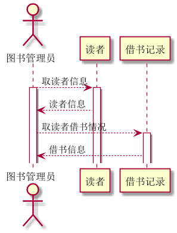
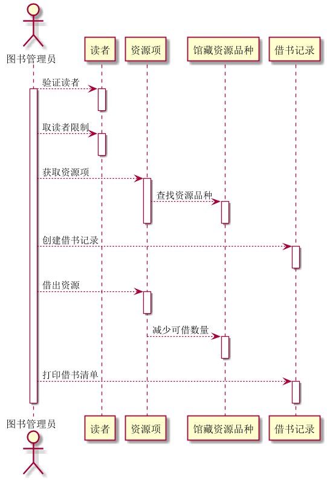
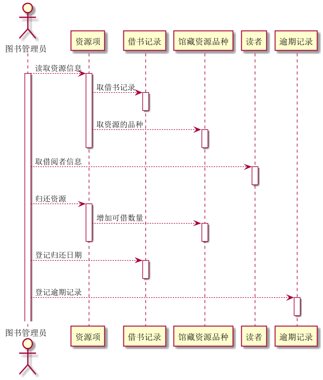

张杰的实验报告
============
## 实验四（test4）：图书管理系统顺序图绘制

|学号|班级|姓名|
|:---------------:|:------------:|:------------:|
|201510414128|软工15-1|张杰|

### 1.图书管理员操作的顺序图

**1.1图书管理员时序图PlantUML源码如下：**
~~~
@startuml
actor 图书管理员

图书管理员 --> 读者: 取读者信息
activate 读者
activate 图书管理员
图书管理员 <-- 读者: 读者信息
deactivate 读者
图书管理员 --> 借书记录: 取读者借书情况
activate 借书记录
图书管理员 <-- 借书记录: 借书信息
@enduml
~~~

**1.2时序图如下：**

**1.3说明如下：**

参与者：图书管理员，读者,借书记录；

### 2.图书管理系统借书信息时序图

**2.1PlantUML源码如下：**
~~~
@startuml

actor 图书管理员

图书管理员 -->读者:验证读者
activate 图书管理员
activate 读者
deactivate 读者

图书管理员 -->读者:取读者限制
activate 读者
deactivate 读者

图书管理员 -->资源项:获取资源项
activate 资源项
资源项-->馆藏资源品种:查找资源品种
activate 馆藏资源品种
deactivate 资源项
deactivate 馆藏资源品种

图书管理员-->借书记录:创建借书记录
activate 借书记录
deactivate 借书记录

图书管理员-->资源项:借出资源
activate 资源项
deactivate 资源项

资源项-->馆藏资源品种:减少可借数量
activate 馆藏资源品种
deactivate 馆藏资源品种

图书管理员-->借书记录:打印借书清单
activate 借书记录
deactivate 借书记录
deactivate 图书管理员

@enduml
~~~

**2.2时序图如下：**

**2.3说明如下：**

参与者：图书管理员，读者，资源项，馆藏资源品种，借书记录；

### 3.归还图书信息的顺序图

**3.1PlantUML源码如下：**
~~~
@startuml

actor 图书管理员

图书管理员 -->资源项:读取资源信息
activate 图书管理员
activate 资源项

资源项-->借书记录:取借书记录
activate 借书记录
deactivate 借书记录

资源项-->馆藏资源品种:取资源的品种
activate 馆藏资源品种
deactivate 馆藏资源品种
deactivate 资源项

图书管理员 -->读者:取借阅者信息
activate 读者
deactivate 读者

图书管理员 -->资源项:归还资源
activate 资源项
资源项-->馆藏资源品种:增加可借数量
activate 馆藏资源品种
deactivate 资源项
deactivate 馆藏资源品种

图书管理员-->借书记录:登记归还日期
activate 借书记录
deactivate 借书记录

图书管理员-->逾期记录:登记逾期记录
activate 逾期记录
deactivate 逾期记录

@enduml
~~~

**3.2对象图如下：**

**3.3说明如下：**

参与者：图书管理员，资源项，借书记录，馆藏资源品种，读者，逾期记录；

