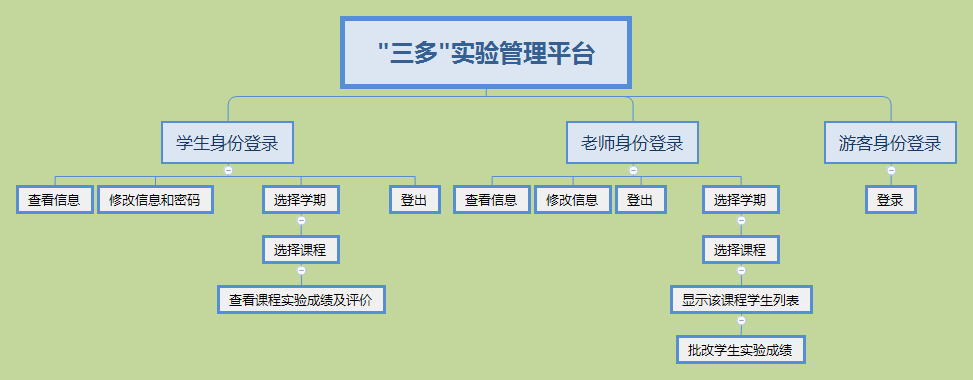
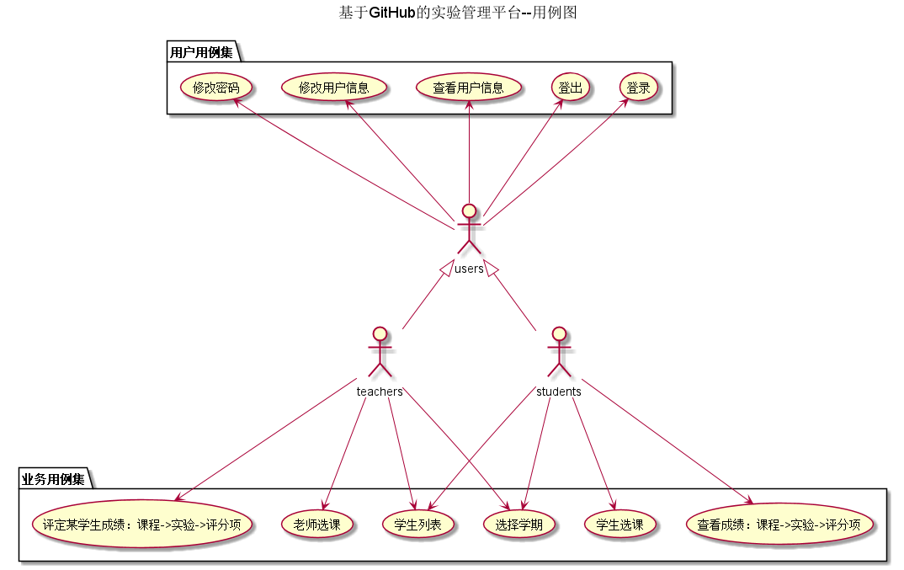
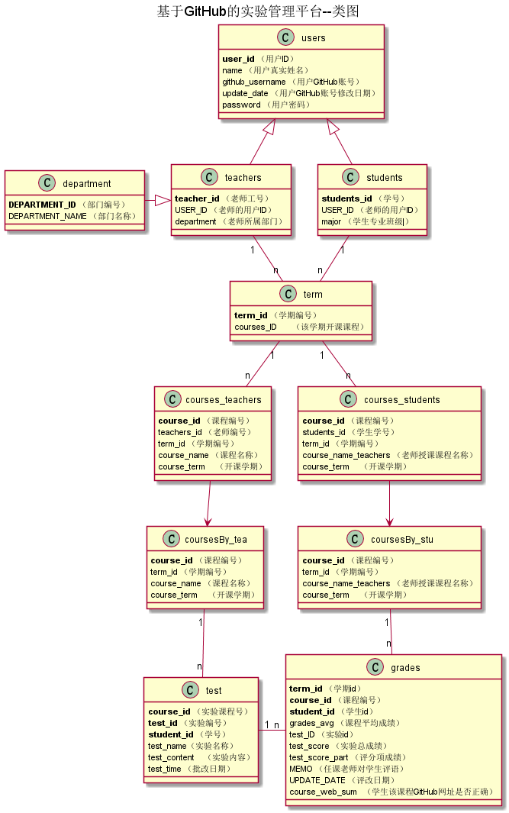


# 基于GitHub的实验管理平台的分析与设计

### 成都大学信息科学与工程学院

|学号|班级|姓名|
|:---------------:|:------------:|:------------:|
|201510414128|软件15-1|张杰|

## 1. 概述
- 基于GitHub的实验管理平台的作用是在线管理实验成绩的Web应用系统。学生和老师的实验内容均存放在GitHUB
页面上。
- 学生的功能主要有：
                    （1）设置自己的GitHub用户名
                    （2）选择学期，课程
                    （3）查询自己各科的实验成绩。
  学生的GitHub用户名是公开的，但成绩不公开。
- 老师的功能主要有：
                    （1）选择学期以及要教授的课程，
                    （2）选择课程并批改每个学生的成绩，
                    （3）查看每个学生的成绩。
- 老师和学生都能通过本系统的链接方便地跳转到学生的每个GitHUB实验目录，以便批改实验或者查看实验情况。
- 实验成绩按数字分数计算，每项实验的满分为100分，最低为0分。
- 系统自动计算每个学生的所有实验的平均分。
    
## 2. 系统总体结构

界面设计参见：https://201510414128.github.io/is_analysis/test6/ui3/登录.html
    
## 3. 用例图设计 [源码](src/UseCase.puml)

## 4. 类图设计 [源码](src/类图.puml)

## 5. 数据库设计
- ### [参见数据库设计](./数据库设计.md)

## 6. 用例及界面详细设计
- ### [“个人课程列表”用例](./用例/个人课程列表.md),[界面](https://201510414128.github.io/is_analysis/test6/ui3/个人课程列表.html)
- ### [“评定成绩”用例](./用例/评定成绩.md),[界面](https://201510414128.github.io/is_analysis/test6/ui3/评定成绩.html)
- ### [“修改密码”用例](./用例/修改密码.md),[界面](https://201510414128.github.io/is_analysis/test6/ui3/修改密码.html)
- ### [“修改用户信息”用例](./用例/修改用户信息.md),[界面](https://201510414128.github.io/is_analysis/test6/ui3/修改用户信息.html)
- ### [“查看用户信息”用例](./用例/查看用户信息.md),[界面](https://201510414128.github.io/is_analysis/test6/ui3/查看用户信息.html)
- ### [“登出”用例](./用例/登出.md),[界面](https://201510414128.github.io/is_analysis/test6/ui3/登出.html)
- ### [“登录”用例](./用例/登录.md),[界面](https://201510414128.github.io/is_analysis/test6/ui3/登录.html)
- ### [“学生选课列表”用例](./用例/学生选课列表.md),[界面](https://201510414128.github.io/is_analysis/test6/ui3/学生选课列表.html)
- ### [“某课程学生列表”用例](./用例/某课程学生列表.md),[界面](https://201510414128.github.io/is_analysis/test6/ui3/某课程学生列表.html) 
- ### [“查看课程实验成绩”用例](./用例/查看课程实验成绩.md),[界面](https://201510414128.github.io/is_analysis/test6/ui3/查看课程实验成绩.html)  
- ### [“老师选课列表”用例](./用例/老师选课列表.md),[界面](https://201510414128.github.io/is_analysis/test6/ui3/老师选课列表.html) 