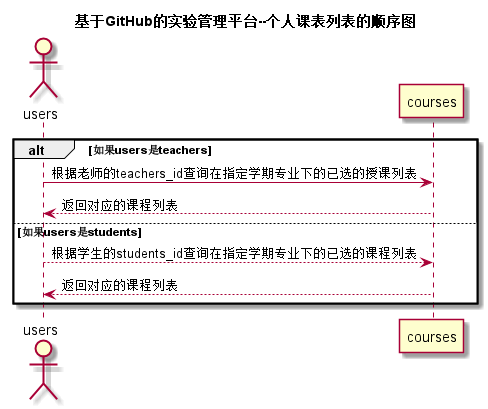
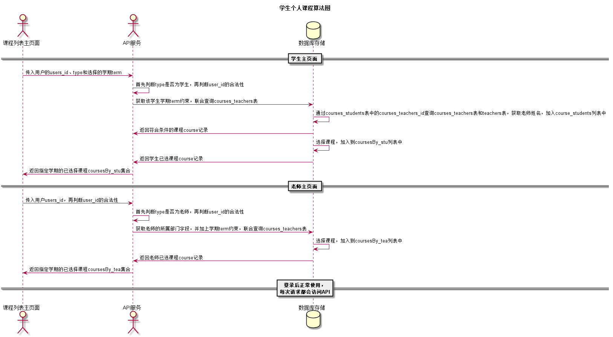

# “个人课程列表”用例 [返回](../README.md)

## 1. 用例规约

|用例名称|个人课程列表|
|-------|:-------------|
|功能|根据学期和专业显示学生的所学的课程列表|
|参与者|学生，老师|
|前置条件| 以学生或者老师的身份登录成功|
|后置条件|所选学期存在所修课程|
|主事件流| 1. 用户选择所修学期和课程 2.系统根据学生学号或者老师工号按照学期名称和所在专业查询所选择课程列表 3.返回符合条件的课程列表 |
|备选事件流|1.提示无课程   &nbsp;&nbsp;|

## 2. 业务流程（顺序图） [源码](../src/个人课程列表.puml)
 

## 3. 界面设计
- 界面参照: https://201510414128.github.io/is_analysis/test6/ui3/个人课程列表.html
- API接口调用
    - 接口1：[getCourses](../接口/getCourses.md)

## 4. 算法描述 [源码](../src/个人课程列表算法图.puml)

    
## 5. 参照表

- [STUDENTS](../数据库设计.md/#STUDENTS)
- [TEACHERS](../数据库设计.md/#TEACHERS)
- [USERS](../数据库设计.md/#USERS)
- [coursesBy_stu](../数据库设计.md/#coursesBy_stu)
- [coursesBy_tea](../数据库设计.md/#coursesBy_tea)
