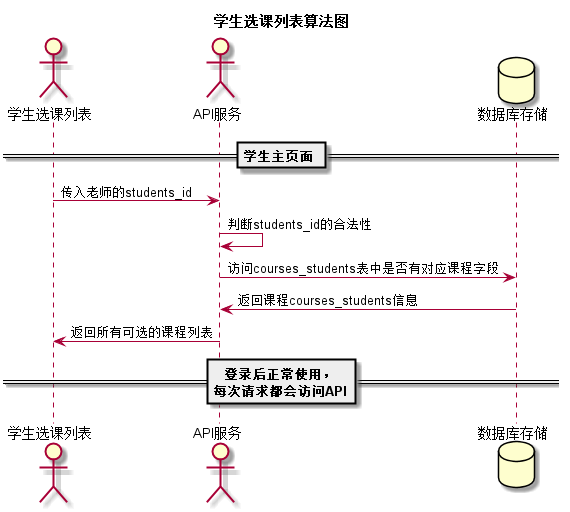

# “学生选课列表”用例 [返回](../README.md)
## 1. 用例规约

|用例名称|学生选课列表|
|-------|:-------------|
|功能|选择课程|
|参与者|学生|
|前置条件|1.必须先登录，并且有可选择的课程  2.必须老师先选课，学生后选|
|后置条件| |
|主事件流| 1.学生选择可选择的课程   2.系统存储选择的课程|
|备选事件流|1a. 如果学生选择的课程已满  &nbsp;&nbsp; 1.系统通知选课选课失败|

## 2. 业务流程
无

## 3. 界面设计
- 界面参照: https://zwdbox.github.io/is_analysis/test6/ui/学生选课列表.html
- API接口调用
    - 接口1：[getCoursesByStu](../接口/getCoursesByStu.md)
    
## 4. 算法描述 [源码](../src/学生选课列表算法图.puml)

    
## 5. 参照表
- [USERS](../数据库设计.md/#USERS)
- [courses_students](../数据库设计.md/#courses_students)
